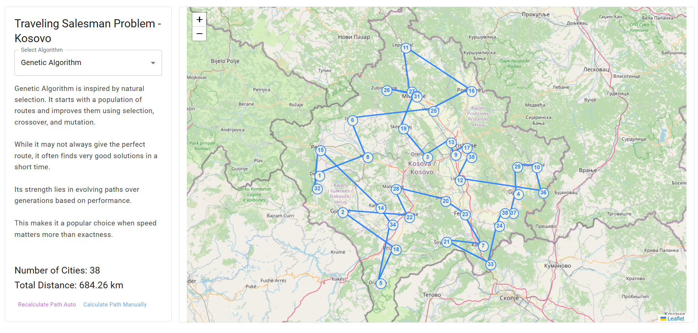

# Traveling Salesman Problem – Kosovo (React + Leaflet App)

A web application that visualizes and solves the Traveling Salesman Problem (TSP) using multiple algorithms over cities in **Kosovo**, displayed interactively on a map.



This app allows both **automatic and manual** city selection, supports multiple optimization techniques, and provides a smooth and responsive user interface.

---

## 🧽 Features

- 🗺 Interactive map of Kosovo (Leaflet.js)
- 🧠 Multiple algorithm choices:
  - Genetic Algorithm
  - Brute Force
  - Dynamic Programming (Held-Karp)
  - Approximation (Nearest Neighbor + 2-opt)
- 🛠 Manual or automatic city selection
- 📊 Distance calculation and real-time results
- 💬 Dialog prompts for large city inputs in slow algorithms
- ⚙️ Web workers for non-blocking processing
- 💎 Refined UI with consistent styling and layout

---

## 🚀 Getting Started

### 1. Clone the Repository

```bash
git clone https://github.com/gresahodolli/travelling-salesman-problem.git tsp-kosovo
cd tsp-kosovo
```

### 2. Install Dependencies

```bash
npm install
```

### 3. Run the App

```bash
npm start
```

Then open [http://localhost:3000](http://localhost:3000) in your browser.

---

## 📚 Algorithms Explained

### 🧬 Genetic Algorithm
An evolutionary algorithm that maintains a population of possible routes. It applies selection, crossover, and mutation over generations to evolve toward better solutions.

- Fast and suitable for larger datasets.
- Does not guarantee optimality, but offers good approximations.

### 🧮 Brute Force
Tests all possible permutations to find the absolute shortest path.

- Guarantees optimal results.
- Not scalable – performance drops drastically as cities increase.

### 🧠 Dynamic Programming (Held-Karp)
Optimizes brute force by breaking the problem into overlapping subproblems and storing results (memoization).

- Still exponential in time, but faster than brute force.
- Best for medium-sized city counts where exactness is needed.

### 🧩 Approximation
Uses heuristics like Nearest Neighbor and 2-opt to find a near-optimal solution.

- Fast and scalable.
- Suitable for real-time or large routing systems.

---

## 📝 Notes

- Manual mode allows clicking to place cities on the map.
- In manual mode, algorithms are executed only after pressing **Done**.
- Brute Force and Dynamic Programming will trigger a dialog warning if city count > 9.

---

## 📄 License

This project is open-source and available under the [MIT License](LICENSE).

---

## 👩‍💻 Author

**Gresa Hodolli**  
